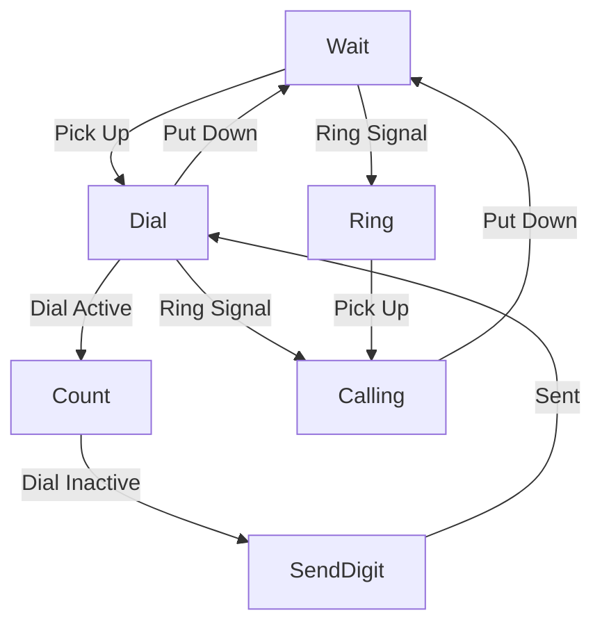

# Drive an old GPO 746 Telephone with ATtiny2313

ATtiny2313 (14745600 crystal)

Phone acts as handset to Android Device

Ring in an old fashioned UK cadence

Scan the dial when the receiver is lifted

## State Machine

## Testing

For testing the USB/Serial communication there's a Linux/LibUSB command-line
program `./bin/usb-test` to eliminate the need for mucking about with Android
during the development phase.
