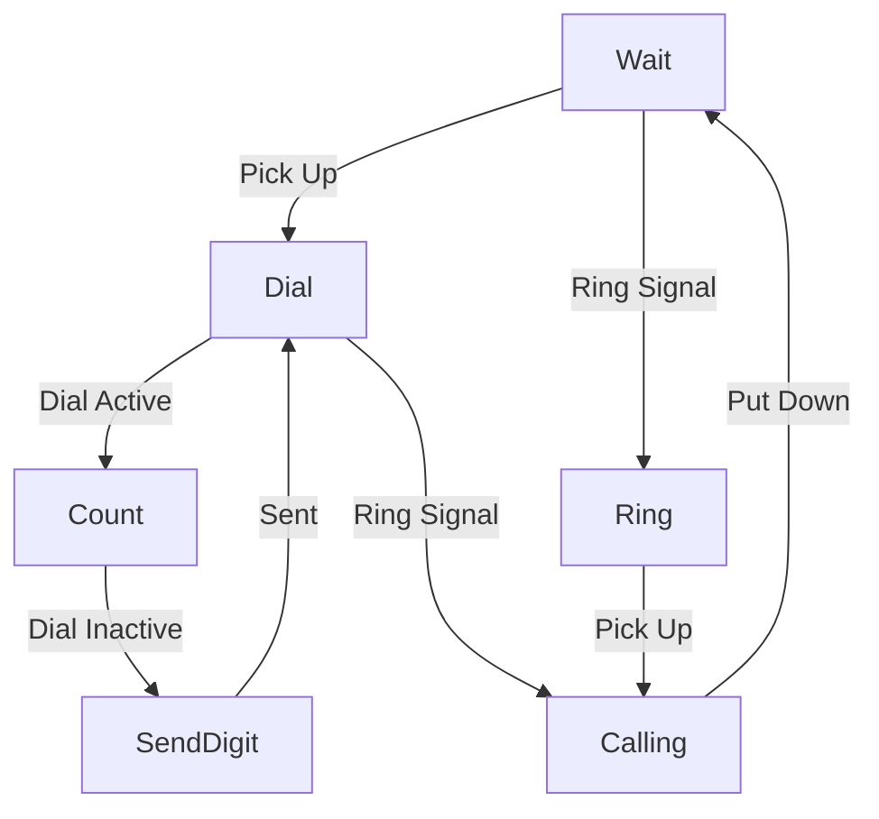

Drive an old GPO 746 Telephone with ATtiny2313
==============================================

ATtiny2313, 14745600 crystal version

The long term aim is to have the phone provide input to an Android App for
making a receiving mobile calls through the handset.

At the moment, we've just got it to ring in an old fashioned UK cadence and
scan the dial when the receiver is lifted.

PCB details: https://easyeda.com/edgeeffect/phone
(The PCB is unfinished - I'm working on stripboard until it's nearer finished)

State Machine
-------------

Testing
-------

For testing the USB/Serial communication there's a LibUSB C program that I've
been running on a Raspberry Pi to eliminate the need for mucking about with
Android during the early testing phases.

https://gitlab.com/edgeeffect/gpo-746-android/-/blob/master/attiny/tests/2-serial.asm
https://gitlab.com/edgeeffect/gpo-746-android/-/tree/master/ch340g-test

For testing the serial/USB link on a Raspberry Pi see ../ch340g-prototype/
